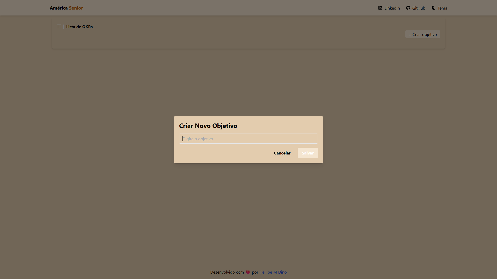

# Gestão de OKRs

Um sistema simples para a criação e gestão de OKRs (Objectives and Key Results) com uma interface intuitiva e fácil de usar.

## Índice

- [Instalação](#instalação)
- [Uso](#uso)
- [Testes](#testes)
- [Capturas de Tela](#capturas-de-tela)
- [Funcionalidades](#funcionalidades)

## Instalação

1. Clone o repositório:
   ```sh
   git clone https://github.com/FellipeMiguel/teste-tecnico-ttz.git
   ```
2. Navegue até o diretório do projeto:
   ```sh
   cd teste-tecnico-ttz
   ```
3. Instale as dependências:
   ```sh
   npm install
   ```

## Uso

1. Inicie o servidor de desenvolvimento:
   ```sh
   npm run dev
   ```
2. Abra [http://localhost:3000](http://localhost:3000) no navegador para ver o resultado.

## Testes

1. Execute os testes:
   ```sh
   npm test
   ```

## Capturas de Tela

### Página Inicial

### Tema Claro


### Tema Escuro


### Criar Objetivo



### Criar Resultado-Chave


### Modal de Confirmação


- [x] Criação de OKRs
- [x] Criação de Resultados-Chave
- [x] Adicionar Entregas aos Resultados-Chave
- [x] Edição de OKRs
- [x] Edição de Resultados-Chave
- [x] Edição de Entregas
- [x] Deleção de OKRs
- [x] Deleção de Resultados-Chave
- [x] Deleção de Entregas
- [x] Exibição de Progresso dos OKRs e Resultados-Chave
- [x] Alternar entre temas claro e escuro
- [x] Modal de Confirmação para Ações
- [x] Integração com MockAPI
